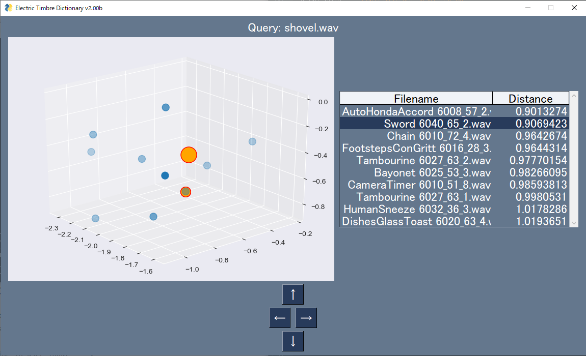

# ElectricTimbreDictionaryV2

A similar environmental sound search system by audio query, based on CNN model.

requirements

・Numpy

・Librosa

・TensorFlow

・Matplotlib

・Scikit-learn

・PysimpleGUI

1.  Extract 128 dim. features from audio by CNN model as extractor.

2. Compress features 128 to 20 dim. by PCA.

3. Visualize audio similarity to 3D space.

The model is trained on [ESC-50 dataset](https://github.com/karolpiczak/ESC-50), and the architecture is based on [audio classification model by W.Shibui](https://qiita.com/cvusk/items/61cdbce80785eaf28349).

